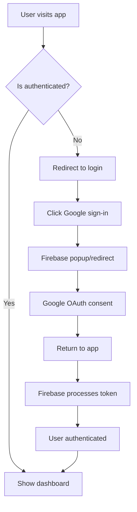

# Firebase Authentication Demo

A complete, production-ready Firebase authentication system with Google OAuth integration, built with React 18, TypeScript, and modern web technologies. This template provides everything you need to implement secure authentication in your web applications.


## 🚀 Features

- **🔐 Complete Firebase Authentication**: Google OAuth with popup and redirect fallbacks
- **⚡ Modern React Stack**: React 18, TypeScript, Vite, Tailwind CSS
- **📱 Responsive Design**: Works seamlessly on desktop and mobile
- **🛡️ Protected Routes**: Automatic route protection for authenticated users
- **🎨 Beautiful UI**: Built with shadcn/ui components and Tailwind CSS
- **🌐 Environment Aware**: Automatic detection of development vs production
- **📋 User Dashboard**: Complete user information and authentication status
- **🔄 State Management**: Proper authentication state with React Context
- **⚙️ Easy Configuration**: Environment-based Firebase configuration
- **📖 AI Agent Friendly**: Clear documentation and code structure

## 🎯 Live Demo

Try the live demo: [Firebase Auth Demo](your-demo-url-here)

- Click "Try Demo Login" to test Google authentication
- View the dashboard to see user information and auth status
- Experience the responsive design on different devices

## 📋 Table of Contents

- [Quick Start](#quick-start)
- [Firebase Setup](#firebase-setup)
- [Environment Configuration](#environment-configuration)
- [Development](#development)
- [Project Structure](#project-structure)
- [Authentication Flow](#authentication-flow)
- [API Reference](#api-reference)
- [Deployment](#deployment)
- [AI Agent Instructions](#ai-agent-instructions)
- [Contributing](#contributing)

## 🚀 Quick Start

### Prerequisites

- Node.js 18 or higher
- Firebase account
- Basic knowledge of React and TypeScript

### Installation

1. **Clone the repository**
   ```bash
   git clone https://github.com/your-username/firebase-auth-demo.git
   cd firebase-auth-demo
   ```

2. **Install dependencies**
   ```bash
   npm install
   ```

3. **Configure Firebase** (see [Firebase Setup](#firebase-setup))

4. **Set environment variables**
   ```bash
   # Copy environment template
   cp .env.example .env
   # Add your Firebase credentials to .env
   ```

5. **Start development server**
   ```bash
   npm run dev
   ```

6. **Open your browser**
   ```
   Navigate to http://localhost:5000
   ```

## 🔥 Firebase Setup

### Step 1: Create Firebase Project

1. Go to [Firebase Console](https://console.firebase.google.com/)
2. Click "Create a project" or select existing project
3. Follow the setup wizard

### Step 2: Enable Authentication

1. In your Firebase project, go to **Authentication**
2. Click **Get started**
3. Go to **Sign-in method** tab
4. Enable **Google** provider
5. Add your support email

### Step 3: Configure Web App

1. Go to **Project Settings** (gear icon)
2. Scroll to "Your apps" section
3. Click **Web app** icon (</>)
4. Register your app with a name
5. Copy the configuration object

### Step 4: Add Authorized Domains

1. In **Authentication > Settings > Authorized domains**
2. Add your development URL (e.g., `localhost`, `your-replit-url.replit.dev`)
3. Add your production domain when deploying

### Step 5: Get Configuration Values

From your Firebase app settings, note these values:
- `apiKey`
- `projectId` 
- `appId`

## ⚙️ Environment Configuration

Create a `.env` file in your project root:

```env
# Firebase Configuration
VITE_FIREBASE_API_KEY=your_api_key_here
VITE_FIREBASE_PROJECT_ID=your_project_id_here
VITE_FIREBASE_APP_ID=your_app_id_here
```

**Important Notes:**
- All environment variables must be prefixed with `VITE_` for frontend access
- These values are safe to be public (they identify your project but don't grant access)
- Real security comes from Firebase Security Rules and authentication

## 🛠️ Development

### Available Scripts

```bash
npm run dev          # Start development server
npm run build        # Build for production
npm run preview      # Preview production build
npm run lint         # Run ESLint
npm run type-check   # Run TypeScript compiler
```

### Development Workflow

1. **Start the development server**
   ```bash
   npm run dev
   ```

2. **The app runs on port 5000**
   - Frontend: Vite dev server with hot reload
   - Backend: Express server for API routes

3. **Authentication Flow**
   - Home page (`/`) - Landing page with demo info
   - Login page (`/login`) - Google authentication
   - Dashboard (`/dashboard`) - Protected route with user info

## 📁 Project Structure

```
firebase-auth-demo/
├── client/                    # Frontend React application
│   ├── src/
│   │   ├── components/        # Reusable UI components
│   │   │   ├── ui/           # shadcn/ui components
│   │   │   └── protected-route.tsx
│   │   ├── hooks/            # Custom React hooks
│   │   │   ├── use-auth.tsx  # Authentication context & hook
│   │   │   └── use-toast.ts  # Toast notifications
│   │   ├── lib/              # Utility libraries
│   │   │   ├── firebase.ts   # Firebase configuration & auth functions
│   │   │   ├── queryClient.ts # TanStack Query client
│   │   │   └── utils.ts      # Utility functions
│   │   ├── pages/            # Page components
│   │   │   ├── home.tsx      # Landing page
│   │   │   ├── login.tsx     # Authentication page
│   │   │   ├── dashboard.tsx # User dashboard
│   │   │   └── not-found.tsx # 404 page
│   │   ├── App.tsx           # Main app component & routing
│   │   ├── main.tsx          # App entry point
│   │   └── index.css         # Global styles & CSS variables
│   └── index.html            # HTML template
├── server/                   # Backend Express server
│   ├── index.ts             # Server entry point
│   ├── routes.ts            # API routes
│   ├── storage.ts           # Storage interface
│   └── vite.ts              # Vite middleware integration
├── shared/                  # Shared types and schemas
│   └── schema.ts            # Database schemas & types
├── package.json             # Dependencies and scripts
├── tailwind.config.ts       # Tailwind CSS configuration
├── tsconfig.json            # TypeScript configuration
├── vite.config.ts           # Vite build configuration
└── README.md                # This file
```

## 🔐 Authentication Flow

### 1. User Authentication Process



### 2. Authentication Components

#### Firebase Configuration (`lib/firebase.ts`)
```typescript
// Core Firebase setup
const firebaseConfig = {
  apiKey: import.meta.env.VITE_FIREBASE_API_KEY,
  authDomain: `${import.meta.env.VITE_FIREBASE_PROJECT_ID}.firebaseapp.com`,
  projectId: import.meta.env.VITE_FIREBASE_PROJECT_ID,
  // ...
}

// Authentication functions
export const signInWithGoogle = async () => {
  // Try popup first, fallback to redirect if blocked
}
```

#### Authentication Context (`hooks/use-auth.tsx`)
```typescript
// Provides authentication state throughout the app
export const AuthProvider = ({ children }) => {
  const [user, setUser] = useState<User | null>(null)
  const [loading, setLoading] = useState(true)
  
  // Listen to auth state changes
  useEffect(() => {
    const unsubscribe = onAuthStateChanged(auth, setUser)
    return unsubscribe
  }, [])
}
```

#### Protected Routes (`components/protected-route.tsx`)
```typescript
// Wrapper component that requires authentication
export const ProtectedRoute = ({ children }) => {
  const { user, loading } = useAuth()
  
  if (loading) return <LoadingSpinner />
  if (!user) return <Redirect to="/login" />
  
  return <>{children}</>
}
```

## 📚 API Reference

### Firebase Authentication Functions

#### `signInWithGoogle()`
Initiates Google sign-in flow with popup/redirect fallback.

```typescript
const handleLogin = async () => {
  try {
    await signInWithGoogle()
    // User is now authenticated
  } catch (error) {
    console.error('Authentication failed:', error)
  }
}
```

#### `logout()`
Signs out the current user.

```typescript
const handleLogout = async () => {
  try {
    await logout()
    // User is now signed out
  } catch (error) {
    console.error('Sign out failed:', error)
  }
}
```

### Authentication Hook

#### `useAuth()`
React hook that provides authentication state.

```typescript
const { user, loading } = useAuth()

// user: Firebase User object or null
// loading: boolean indicating if auth state is being determined
```

### User Object Properties

```typescript
interface User {
  uid: string                    // Unique user identifier
  email: string | null           // User's email address
  displayName: string | null     // User's display name
  photoURL: string | null        // User's profile photo URL
  emailVerified: boolean         // Whether email is verified
  isAnonymous: boolean          // Whether user is anonymous
  metadata: {
    creationTime?: string        // Account creation timestamp
    lastSignInTime?: string      // Last sign-in timestamp
  }
}
```

## 🌐 Deployment

### Replit Deployment

1. **Fork this Repl**
2. **Add environment variables** in Secrets tab
3. **Run the application**
4. **Add your Replit URL** to Firebase authorized domains

### Vercel Deployment

1. **Connect GitHub repository** to Vercel
2. **Set environment variables** in Vercel dashboard
3. **Deploy automatically** on git push
4. **Add your Vercel URL** to Firebase authorized domains

### Netlify Deployment

1. **Connect GitHub repository** to Netlify
2. **Set build command**: `npm run build`
3. **Set publish directory**: `dist`
4. **Add environment variables** in Netlify dashboard
5. **Add your Netlify URL** to Firebase authorized domains

### Environment Variables for Production

```env
VITE_FIREBASE_API_KEY=your_production_api_key
VITE_FIREBASE_PROJECT_ID=your_production_project_id
VITE_FIREBASE_APP_ID=your_production_app_id
```

## 🤖 AI Agent Instructions

This section provides clear instructions for AI agents to understand and implement this Firebase authentication system.

### Project Overview for AI Agents

This is a **complete Firebase authentication template** with the following characteristics:

1. **Technology Stack**: React 18 + TypeScript + Vite + Tailwind CSS + Firebase
2. **Authentication**: Google OAuth with popup/redirect fallback
3. **Routing**: wouter for client-side routing with protected routes
4. **State Management**: React Context for auth state
5. **UI Components**: shadcn/ui with Tailwind CSS styling

### Key Implementation Patterns

#### 1. Firebase Configuration Pattern
```typescript
// Always use environment variables for Firebase config
const firebaseConfig = {
  apiKey: import.meta.env.VITE_FIREBASE_API_KEY,
  projectId: import.meta.env.VITE_FIREBASE_PROJECT_ID,
  // Never hardcode these values
}
```

#### 2. Authentication State Pattern
```typescript
// Use React Context for global auth state
const AuthContext = createContext<AuthContextType>()

// Provide auth state throughout app
export const AuthProvider = ({ children }) => {
  // Listen to Firebase auth state changes
  useEffect(() => {
    const unsubscribe = onAuthStateChanged(auth, setUser)
    return unsubscribe
  }, [])
}
```

#### 3. Protected Route Pattern
```typescript
// Wrapper component for authentication-required pages
export const ProtectedRoute = ({ children }) => {
  const { user, loading } = useAuth()
  
  if (loading) return <LoadingSpinner />
  if (!user) return <Redirect to="/login" />
  return <>{children}</>
}
```

#### 4. Authentication Flow Pattern
```typescript
// Try popup first, fallback to redirect if blocked
export const signInWithGoogle = async () => {
  try {
    return await signInWithPopup(auth, googleProvider)
  } catch (error) {
    if (error.code === 'auth/popup-blocked') {
      return signInWithRedirect(auth, googleProvider)
    }
    throw error
  }
}
```

### File Modification Guidelines for AI Agents

When modifying this project:

1. **Never modify** `vite.config.ts` or `package.json` unless absolutely necessary
2. **Always use** the existing UI components from `components/ui/`
3. **Follow** the established folder structure in `client/src/`
4. **Use** TypeScript for all new files
5. **Maintain** the authentication patterns shown above
6. **Test** authentication flow after any auth-related changes

### Common Customizations

#### Adding New Protected Routes
```typescript
// 1. Create new page component
export default function NewPage() {
  const { user } = useAuth()
  return <div>Protected content for {user?.email}</div>
}

// 2. Add route in App.tsx
<Route path="/new-page">
  <ProtectedRoute>
    <NewPage />
  </ProtectedRoute>
</Route>
```

#### Adding Additional Auth Providers
```typescript
// 1. Import provider in firebase.ts
import { GithubAuthProvider } from 'firebase/auth'

// 2. Create provider instance
export const githubProvider = new GithubAuthProvider()

// 3. Create sign-in function
export const signInWithGithub = async () => {
  try {
    return await signInWithPopup(auth, githubProvider)
  } catch (error) {
    if (error.code === 'auth/popup-blocked') {
      return signInWithRedirect(auth, githubProvider)
    }
    throw error
  }
}
```

#### Customizing User Dashboard
```typescript
// Access user data in any component
const { user } = useAuth()

// Available user properties
user?.uid           // Unique identifier
user?.email         // Email address
user?.displayName   // Display name
user?.photoURL      // Profile photo
user?.emailVerified // Email verification status
```

## 🤝 Contributing

We welcome contributions! Please follow these guidelines:

1. **Fork the repository**
2. **Create a feature branch** (`git checkout -b feature/amazing-feature`)
3. **Follow the code style** (TypeScript, Prettier, ESLint)
4. **Test your changes** thoroughly
5. **Update documentation** if needed
6. **Submit a pull request**

### Development Guidelines

- Use TypeScript for all new code
- Follow the existing component patterns
- Add proper error handling
- Include test IDs for interactive elements (`data-testid`)
- Update documentation for new features

### Code Style

- Use functional components with hooks
- Prefer `const` over `let` where possible
- Use descriptive variable names
- Add JSDoc comments for complex functions
- Follow the established folder structure

## 📄 License

This project is licensed under the MIT License - see the [LICENSE](LICENSE) file for details.

## 🙏 Acknowledgments

- [Firebase](https://firebase.google.com/) for authentication services
- [React](https://reactjs.org/) for the UI framework
- [Tailwind CSS](https://tailwindcss.com/) for styling
- [shadcn/ui](https://ui.shadcn.com/) for UI components
- [Vite](https://vitejs.dev/) for build tooling

## 📞 Support

- **Documentation**: Check this README and inline code comments
- **Issues**: Create an issue on GitHub
- **Discussions**: Use GitHub Discussions for questions
- **Email**: your-email@example.com

---

**Made with ❤️ for the developer community**